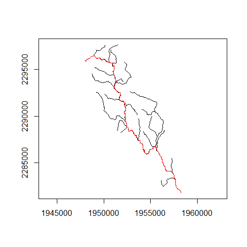
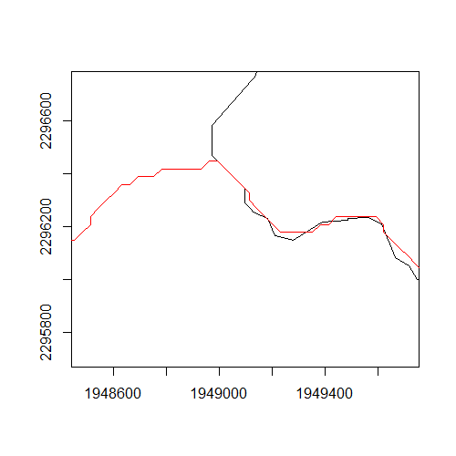
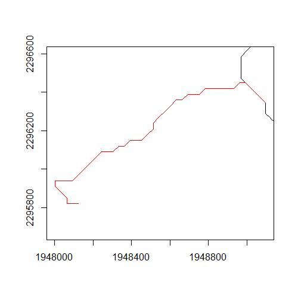
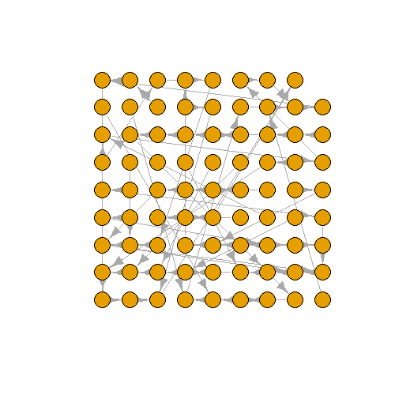

class: title-slide
```{r setup, include=FALSE}
options(htmltools.dir.version = FALSE)
```

# n-sink rasterization: process outline
</br>
</br>
</br>
</br>
## Jeff Hollister and Q Kellogg
## 2018-09-26

---
class: center, middle

# Acquire 

---
# Acquire: Summary

.left-column[
- NHD
- SSURGO
- NLCD Impervious Surface
]

.right-column[

]
---
# Acquire: NHD+ 12-digit HUCs

.left-column[
- Source file
  - NHDPlusV21_NE_01_WBDSnapshot_03.7z
- Source data
  - Shapefile
  - NHDPlusNE/NHDPlus01/WBDSnapshot/WBD/WBD_Subwatershed]

.right-column[

]
---
# Acquire: NHD+ Flowlines

.left-column[
- Source file
  - NHDPlusV21_NE_01_NHDSnapshot_04.7z
- Source data
  - Shapefile
  - NHDPlusNE/NHDPlus01/NHDSnapshot/Hydrography/NHDFlowline
]

.right-column[

]

---
# Acquire: NHD+ Waterbodies

.left-column[
- Source file
  - NHDPlusV21_NE_01_NHDSnapshot_04.7z
- Source data
  - Shapefile
  - NHDPlusNE/NHDPlus01/NHDSnapshot/Hydrography/NHDWaterbody
]

.right-column[

]

---
# Acquire: NHD+ Flow Direction

.left-column[
- Source file
  - NHDPlusV21_NE_01_01a_FdrFac_01.7z
- Source data
  - ESRI Raster
  - NHDPlusNE/NHDPlus01/NHDPlusFdrFac01a/fdr
]

.right-column[

]

---
# Acquire: NHD+ Data Tables

.left-column[
- Source files
  - NHDPlusV21_NE_01_NHDPlusAttributes_08.7z
  - NHDPlusV21_NE_01_EROMExtension_05.7z
- Source Data
  - dbf
  - Time of Travel (TOTMA): NHDPlusNE/NHDPlus01/NHDPlusAttributes/PlusFlowlineVAA.dbf
  - Discharge (Q0001E): NHDPlusNE/NHDPlus01/EROMExtension/EROM_MA0001.DBF 
]

.right-column[

]

---
# Acquire: SSURGO

.left-column[
- Basis for Hydric Soils
- Anything but straightforward (more later)
- Download from: ???
- Which pieces: ???
]

.right-column[

]
---
# Acquire: Impervious Surface

.left-column[
- used to mask out hydric soils
- source data: 2007 NLCD Impervious
- source files: ???
]

.right-column[

]

---
class: center, middle

# Clean

---

#Clean: Specific HUC

- NHD+ is for all of New England
- Narrow down to Specific HUC 12 
- Niantic as example

---

#Clean: Raster Conformity

- Rasters will have small differences
- Need to force to same origin and projection


```
class       : RasterLayer 
dimensions  : 31405, 25845, 811662225  (nrow, ncol, ncell)
resolution  : 30, 30  (x, y)
extent      : 1643925, 2419275, 2200425, 3142575  (xmin, xmax, ymin, ymax)
coord. ref. : +proj=aea +lat_1=29.5 +lat_2=45.5 +lat_0=23 +lon_0=-96 
+x_0=0 +y_0=0 +ellps=GRS80 +towgs84=0,0,0,0,0,0,0 +units=m +no_defs 
 
 
class       : RasterLayer 
dimensions  : 535, 378, 202230  (nrow, ncol, ncell)
resolution  : 30, 30  (x, y)
extent      : 1947688, 1959028, 2281794, 2297844  (xmin, xmax, ymin, ymax)
coord. ref. : +proj=aea +lat_1=29.5 +lat_2=45.5 +lat_0=23 +lon_0=-96 
+x_0=0 +y_0=0 +ellps=GRS80 +towgs84=0,0,0,0,0,0,0 +units=m +no_defs 
```

---

# Acquire and Clean: Miscellany

- As currently written:
  - Provides NHD+ data for all of New England
  - Gets impervious and SSURGO for specific HUC
  - Cache data locally
  - Takes ~ 15 minutes for all of this
    - 90% of that is downloading SSURGO

---
class: center, middle

# Create 

---
# Create: Land removal

- SSURGO hydric soils
- Impervious Surface masked out
- Combine
  - Spatial map units 
  - Non-spatial components 
    - Hydric/Not hydric
    - Percent hydric
  - Sum percent hydric
- Calculate nitrogen removal
  - 0.8 * percent hydric
  - Kellogg et al. 2010, Table 2
  


---
# Create: Stream removal

- get Q (Q0001E from EROM_MA0001.DBF)
- Time of Travel (TOTMA from PlusFlowlineVAA.dbf)
- Calculate mean reach depth
  - 0.2612 * Q(in cms)^0.3966^
  - Kellogg et al. 2010, eq. 6
- Calculate nitrogen removal
  - 1 - exp(-0.0513 * mean reach depth^-1.319^)
  - Kellogg et al. 2010, eq. 5
  


---
# Create: Lake removal

- Mean depth (MeanDepth from PlusWaterbodyLakeMorphology.dbf)
- Lake residence time (Sum of TOTMA, for lake flow paths from PlusFlowlineVAA.dbf and NHD+ Streams)
  - Convert to years
- Calculate nitrogen removal
  - 79.24 - 33.26 * log10(Mean Depth/Residence Time)
  - Kellogg et al. 2010, eq. 1


---
# Create: Final rasters

- removal
 - Convert each to raster at 10m
 - Merge hydric and lakes
 - Filter and roll up to 30m
- type
- stack


---

.left-column[
# Create: Flowpath 
- Flow direction + NHD Plus Streams
- Starting point
  - Interactive
  - Programatic
- Difference
  - Flow path
  - Stream flow lines
]

.right-column[
</img>

</img>
]

---

.left-column[
# Create: Flowpath
- Use streams, not genearated flowpath
- Flowpath from land to stream network
- Combine exsiting stream network with overland flow
- Fun with graphs!
]

.right-column[
</img>

</img>
]

---
class: center, middle

# Summarize 

---
# Summarize: Extract 

- Combine flowpath
- Extract raster values along flowpath


---
# Summarize: Clean

- Removal is now a vector of values
- Rasterization funny business
- Filter to 3x3 using time series tools
- Extract last for each type

```
#Original
0.5, 0.5, 0.5, 0.1, 0.5, 0.1, 0.1, 0.1, 0.02, 0.02, 0.8, 0.02, 0.8, 0.02
#Filtered
#Last
```
---
.left-column[
# Summarize: Report

- Filtered vectors to a dataframe
- Group on segment id and summarize
]

.right-column[
| type_code|   removal|segment_type | segment_id|
|---------:|---------:|:------------|----------:|
|         1| 0.0400000|Hydric       |          1|
|         1| 0.0240000|Hydric       |          2|
|         1| 0.0240000|Hydric       |          2|
|         1| 0.0240000|Hydric       |          2|
|         1| 0.0240000|Hydric       |          2|
|         1| 0.0240000|Hydric       |          2|
|         1| 0.0240000|Hydric       |          2|
|         1| 0.0240000|Hydric       |          2|
|         3| 0.5691588|Lake/Pond    |          9|
|         3| 0.5691588|Lake/Pond    |          9|

(Truncated)

|segment_type | length| percent_removal|   n_in| n_out|
|:------------|------:|---------------:|------:|-----:|
|Hydric       |     30|           4.000| 100.00| 96.00|
|Hydric       |    210|           2.400|  96.00| 93.70|
|Lake/Pond    |   3210|          56.916|  93.70| 40.37|
|Stream       |    210|           0.015|  40.37| 40.36|
|Lake/Pond    |    570|          20.872|  40.36| 31.94|
|Stream       |   2070|           0.055|  31.94| 31.92|
|Lake/Pond    |    690|           8.654|  31.92| 29.16|
|Stream       |    150|           0.003|  29.16| 29.16|
|Lake/Pond    |    690|          35.045|  29.16| 18.94|
|Lake/Pond    |     90|          69.600|  18.94|  5.76|

]

---
class: center, middle

# Now what?

---
# Now what?: Static Maps
- Which static maps to create?
- Brute force
- Something else?
  - Flow accumulation?

---
# Now what?: R Package
- Code for doing this is a hot-mess
- R package is obvious solution
- Facilitates use with other tools
  - e.g. ArcGIS R Bridge

---
# Now what?: Hybrid approach?
- Some issues with rasterization process in streams and lakes
- Use raster for land based only
- Rest of flow path should be only stream or lake
  - no need for raster
- Create flowline with per reach removal
- Thinking is in process
  
---
# Now what?: Web UI
- Stay in R?
  - Shiny
- ArcGIS?
  - Would need to use R Bridge for Arc
    - <https://r-arcgis.github.io/>
  - Or...
  - Re-work some portion of the workflow
    - Flow path generation
    - Extracting
    - Summarizing
---
class: center, middle

# Thanks and Questions!

Slides created via the R package [**xaringan**](https://github.com/yihui/xaringan).